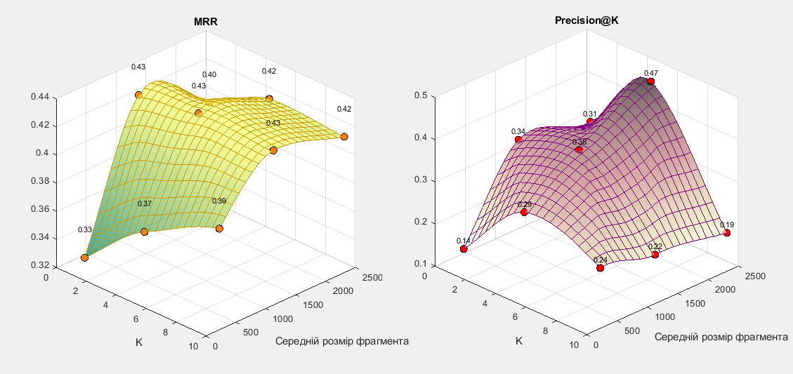

# Робота розробленого застосунку

---

## Ефективність пошуку з різними параметрами

---

## Блок-схема побудови бази знань для RAG системи

---

## Архітектура побудованого застосунку

---

## Зчитування фрагментів знань з використанням відкритої бібліотеки Unstructured

